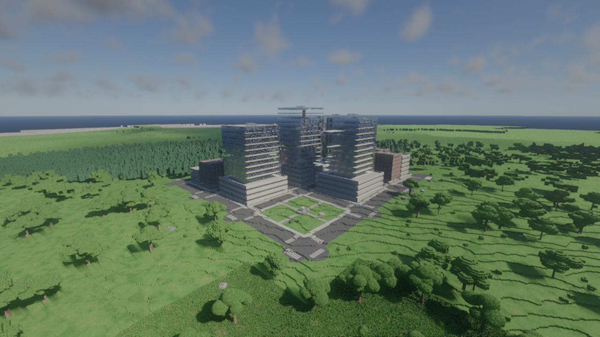
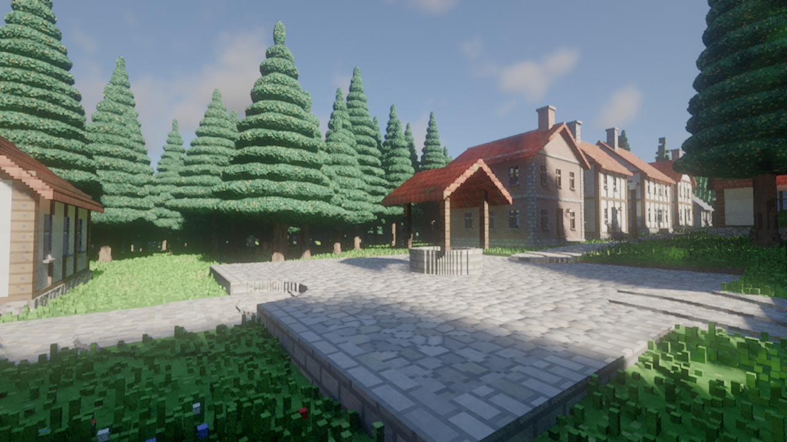
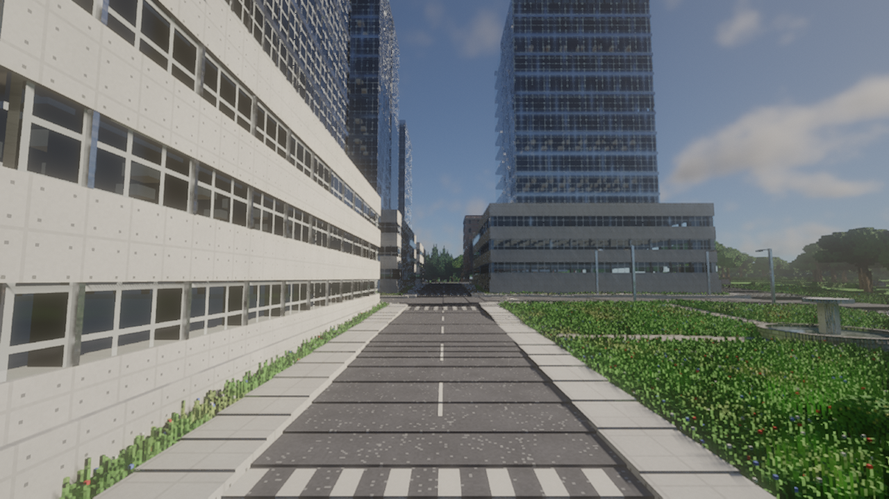
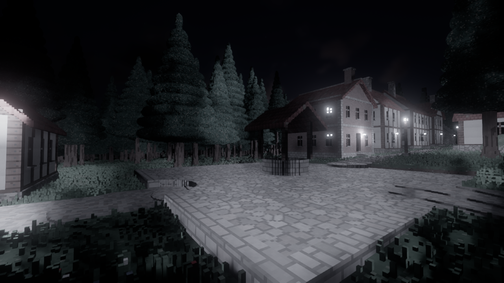
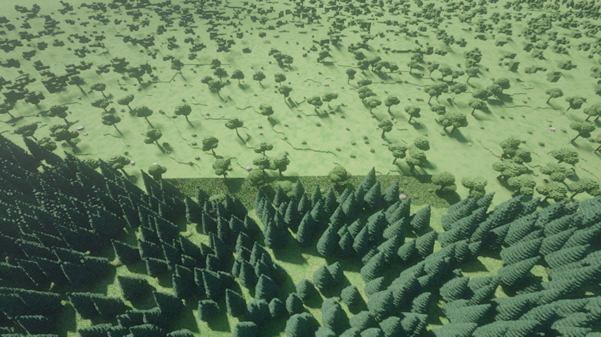
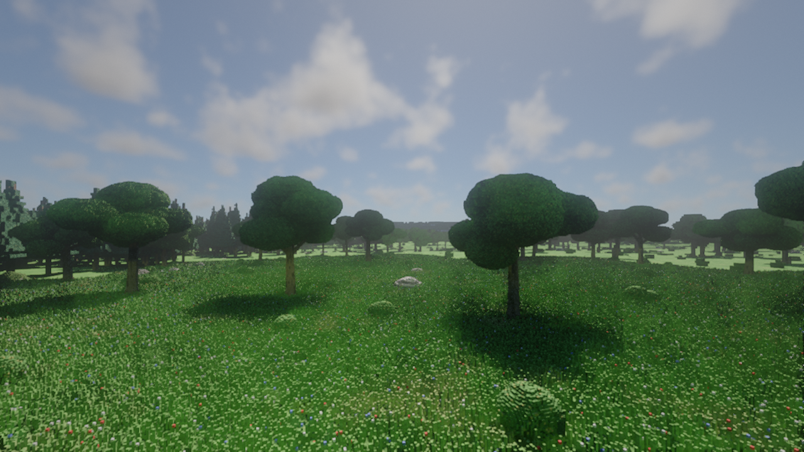
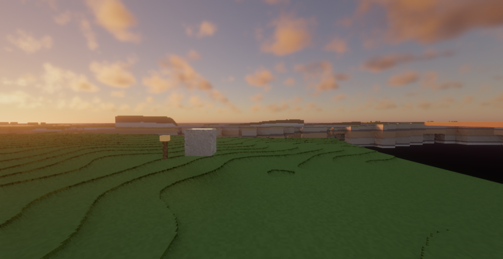
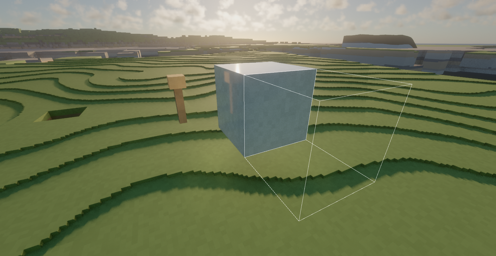
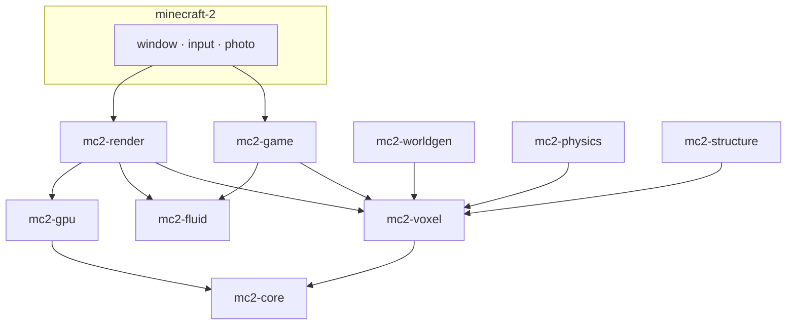

<p align="center">
  
</p>

<h1 align="center">MINECRAFT 2</h1>

<p align="center">
  <strong>A voxel sandbox that meshes nothing.</strong><br />
  Sparse voxels, ray marched in compute shaders, written in Rust on wgpu.
</p>

<p align="center">
  <a href="https://github.com/Anandb71/minecraft-2/actions/workflows/ci.yml"></a>
  <a href="LICENSE"></a>
  
  
  <a href="https://anandb71.in"></a>
</p>

<p align="center">
  <a href="#play">Play</a> ·
  <a href="#gallery">Gallery</a> ·
  <a href="docs/getting-started.md">Getting started</a> ·
  <a href="docs/controls.md">Controls</a> ·
  <a href="docs/architecture.md">Architecture</a> ·
  <a href="#author">Author</a>
</p>

The world is a sparse voxel structure marched directly in compute shaders.
Resolution, traced lighting, arbitrary destruction and (later) traced audio
all come from the same acceleration structure. There is no mesh, no greedy
meshing pass, no LOD that turns a mountain into a handful of quads.

Not affiliated with Mojang or Microsoft. The name is a joke that got out of
hand; the renderer is not.

> Under construction. Systems land in the order at the bottom; each is tagged
> when it runs. Flora, towns, survival and a gamepad already do.

## Gallery

<p align="center">
  
</p>

<p align="center"><em>A village around a cobbled well. Every board, brick and pine needle is a 6.25 cm voxel.</em></p>

<table>
  <tr>
    <td width="50%"><br /><em>Towns on a street grid, glass and concrete, road markings.</em></td>
    <td width="50%"><br /><em>Night: lanterns are ReSTIR emitters, the moon is a real phase.</em></td>
  </tr>
  <tr>
    <td><br /><em>Ten biomes. Trees, bushes and fallen logs built from voxels, visible from the horizon.</em></td>
    <td><br /><em>Plains of grass and flowers. Climate cools with height.</em></td>
  </tr>
  <tr>
    <td><br /><em>Hillaire atmosphere, photometric units, time of day from latitude and season.</em></td>
    <td><br /><em>Glass you can see through. Snell's law, absorption, Fresnel.</em></td>
  </tr>
</table>

## Why

Minecraft's world becomes a triangle mesh. Meshes are a poor fit for a game
where the player can carve 6.25 cm of rock out of a 16 km continent, then
stand in the hole and look at the sky through the gap.

This engine never builds that mesh. A brickmap of palette-compressed voxels
sits under per-chunk 64-trees. A compute shader marches it. Soft shadows,
bounce light, reflections, clouds and fog all trace the same tree. When a
blast throws debris, the fragments are rigid bodies marched with the terrain.
When a column is cut, load flows through real materials and the tower comes
down as pieces you can walk on.

The CPU reference marcher and the GPU marcher are checked pixel for pixel.
Golden images run on WARP so CI does not depend on a vendor.

## Play

Rust stable (edition 2024) and a GPU with Vulkan, DX12 or Metal.

```bash
git clone https://github.com/Anandb71/minecraft-2.git
cd minecraft-2
cargo run --release
```

Left click captures the mouse. A pad starts play on the first stick or
button. The first launch erodes the world (about 30 s) and caches it under
`worlds/default`.

```bash
cargo run --release -- --creative
cargo run --release -- --seed 7 --time 21.5
cargo run --release -- --capture shot.png --frames 120 --size 2560x1440
```

Full flags, quality tiers and tests: [docs/getting-started.md](docs/getting-started.md).
Keys, pad and photo mode: [docs/controls.md](docs/controls.md).

## What is in

**World.** 16 km grown from geology: continents and ridged belts, eroded
once by a virtual-pipe hydraulic model. Stratified rock (basement, cyclic
sediments, folds, volcanic provinces) exposed by that erosion. Ores that
follow their host. Four LODs streamed on worker threads; buried rock is not
generated until someone digs.

**Biomes and settlements.** Climate cools with height: oak and birch forest,
pine and snowy taiga, plains, desert, alpine rock and snow, beaches and sea.
Villages around a plaza and well. Towns on a street grid with lamps, parks
and glass towers, lit at night. Caves dissolve limestone, chalk and marble
along joints and bedding, with sinkholes under rivers; they are not noise
worms.

**Renderer.** Visibility buffer with exact voxel ids. Physically based sky
(Hillaire 2020). Traced soft shadows. ReSTIR from every emissive cluster.
Radiance cascades or ReSTIR GI. SVGF. Volumetric clouds that shadow the
ground. Froxel fog with light shafts. Glossy reflections. AgX. Photo mode
with focal length, focus, aperture and exposure.

**Fire and weather.** Blocks burn by what they hold, spread uphill and
downwind, char wood to charcoal and light the night; water and rain put
them out. Clear, cloudy, rain and storm drift by with the wind: rain soaks
open ground into glossy stone and mirror puddles, snow falls where it is
cold, and lightning comes down as a real bolt of light that can start a
fire.

**Water.** Free-surface lattice Boltzmann on the GPU in half-metre cells,
written back into the voxel world as it flows, so it is lit, refracted and
reflected like everything else. The sea stays still until you dig beside
it, then pours in. Buckets carry it.

**Destruction.** XPBD rigid bodies. TNT with fuses and chain reactions.
Structural integrity over the 1 m block layer: an unsupported stone arm
snaps at about 3 m, a plank one at 23 m, soil cannot overhang at all.
Collapses become debris, then terrain again once they settle.

**Play.** First and third person, voxel collision, step-up, crouch, fly.
Build on the 1 m grid or carve 6.25 cm voxels. Survival with hardness,
tools that wear out, 36 slots, 44 recipes, a furnace. Creative is a flag.
Xbox-layout gamepad.

**Engine.** Own frame graph. GPU timestamps on every pass. WGSL hot reload
in debug. Brick streaming from marcher feedback, so unseen surfaces never
cost VRAM.

## Architecture



6.25 cm voxels, 4-bit palette bricks, per-chunk 64-trees. Physics at 120 Hz
on its own thread (4 ms tick). The frame budget is 16.6 ms at 1440p / 60 fps
on a mid-range 2024 discrete GPU.

Crate map, invariants and the budget table: [docs/architecture.md](docs/architecture.md).
Why each fork went the way it did: [DECISIONS.md](DECISIONS.md).
What it cost: [DEVLOG.md](DEVLOG.md).

## Status

| | Step | Tag |
|---|---|---|
| done | Harness, frame graph, HUD, golden CI | `v0.1-harness` |
| done | Brickmap, 64-tree, CPU marcher | `v0.2-brickmap` |
| done | GPU marcher, visibility, brick streaming | `v0.3-marcher` |
| done | Worldgen v1, streaming, LOD | `v0.4-worldgen` |
| done | Player, collision, carve and place | `v0.5-player` |
| done | Sky, traced shadows, ReSTIR | `v0.6-lighting` |
| done | Indirect light, denoise, upsample | `v0.7-indirect` |
| done | Reflections, volumetrics, clouds, photo mode | `v0.8-atmosphere` |
| done | Rigid bodies, destruction | `v0.9-destruction` |
| done | Structural integrity | `v0.10-structure` |
| done | Water: lattice Boltzmann on the GPU | `v0.11-fluids` |
| done | Fire, heat, wind, weather | `v0.12-weather` |
| now | Worldgen v2: tectonics, caves, ecology | |
| next | Animation, IK, ragdolls | |
| next | NPCs, economy, vehicles | |
| next | Traced audio | |
| next | Persistence, settings, polish | |

Flora, settlements, survival and the gamepad landed beside that list, not
instead of it.

## Contributing

Bugs, measurements and small fixes are welcome. New dependencies and
architectural rewrites need a conversation: this repo keeps a written
record of why the last choice won.

See [CONTRIBUTING.md](CONTRIBUTING.md). Be decent:
[CODE_OF_CONDUCT.md](CODE_OF_CONDUCT.md). Vulnerabilities:
[SECURITY.md](SECURITY.md).

```bash
cargo fmt --all
cargo clippy --workspace --all-targets -- -D warnings
cargo test --workspace
```

## Author

**[Anand B](https://anandb71.in)** ([@Anandb71](https://github.com/Anandb71))


I care about engines you can measure. If a pass is over budget, the HUD
turns red. If two architectures are on the table, [DECISIONS.md](DECISIONS.md)
says what was timed and what was cut.

## License

[MIT](LICENSE). Copyright 2026 Anand B.
