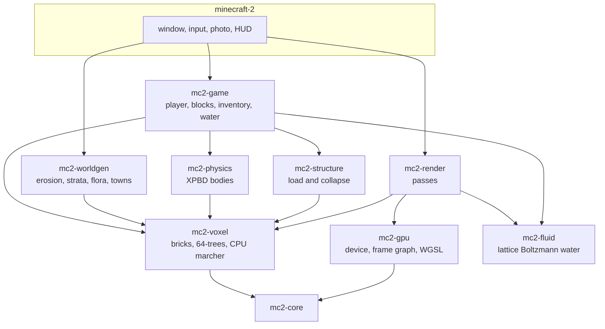

# Architecture

Minecraft 2 meshes nothing. The world is 6.25 cm voxels in 4-bit palette
bricks, under per-chunk sparse 64-trees, ray marched in a compute shader.
Lighting, destruction, rigid bodies and (later) audio all read that same
structure.

The why behind each fork lives in [DECISIONS.md](../DECISIONS.md). What it
cost to build each step lives in [DEVLOG.md](../DEVLOG.md).

## Crates

| Crate | Job |
|---|---|
| `mc2-core` | Profiler, rolling stats |
| `mc2-gpu` | Device, frame graph, shader library, timestamp profiler, capture |
| `mc2-voxel` | Bricks, 64-trees, materials, GPU layout, CPU reference marcher |
| `mc2-game` | ECS game state, player, collision, blocks, interaction, inventory |
| `mc2-worldgen` | Noise, strata, erosion, plates, flora, karst, settlements, chunk streaming |
| `mc2-physics` | Rigid bodies (XPBD), contacts, explosions, baking |
| `mc2-structure` | Load graph, stress, collapse |
| `mc2-fluid` | Free-surface lattice Boltzmann water: the CPU reference the GPU version is tested against |
| `mc2-render` | Passes, voxel residency, bodies, the renderer |
| `shaders/` | WGSL with `#import` |
| `golden/` | Reference images for the WARP tests |

The binary in `src/` owns the window, gamepad, photo mode, headless capture
and the HUD that is not the inventory.

## World

- 16 384 m square, 512 m tall, addressed in `i32` voxels.
- Voxel 6.25 cm. Block 1 m. Chunk 32 m. Bricks 8³ with 4-bit palettes.
- Each chunk is a three-level 64-tree. Chunks sit under 128 m and 512 m
  trees per sector.
- Erosion is CPU, seed-deterministic: the same seed on two GPUs has to grow
  the same mountains. The first launch writes `worlds/default`; later
  launches skip the 30 s pass.
- Buried rock is not generated until someone digs. Four LODs stream around
  the camera on worker threads.
- Marcher feedback uploads only bricks a ray actually hit, plus a 12 m
  radius the player can touch.

## Frame

A visibility buffer with exact voxel ids, then:

1. Beam prepass, primary march
2. ReSTIR direct light from emissive clusters
3. Radiance cascades or ReSTIR GI
4. Traced reflections
5. SVGF, temporal upsample
6. Clouds, froxel fog, atmosphere LUTs
7. Post: AgX, bloom, motion blur, optional thin-lens DoF

Physics is a 120 Hz thread with a 4 ms tick budget. Structure is gathered a
millisecond a frame and solved on another thread.

## Frame budget

1440p, 60 fps, mid-range 2024 discrete GPU. 16.6 ms. The profiler HUD turns
a line red when its p99 exceeds the budget.

| Line | Budget |
|---|---|
| Primary visibility march | 2.5 ms |
| Direct light (ReSTIR) | 2.0 ms |
| Indirect light | 2.5 ms |
| Reflections | 1.0 ms |
| Denoise and upsample | 2.0 ms |
| Volumetrics and clouds | 2.0 ms |
| Atmosphere and sky | 0.5 ms |
| Fluid and fire (amortized) | 1.5 ms |
| Post and present | 1.0 ms |
| Headroom | 1.6 ms |

Development numbers in the devlog were taken on Intel UHD (Raptor Lake, 16
EUs) with the discrete GPU off, so they are roughly an order of magnitude
slower than this table.

## Invariants

- Worlds are seed-deterministic and GPU-independent.
- The GPU marcher is checked pixel-for-pixel against the CPU reference
  marcher.
- Golden images run on WARP so CI does not depend on a vendor.
- A new dependency needs a line in `DECISIONS.md` saying why it beats
  writing the thing.
